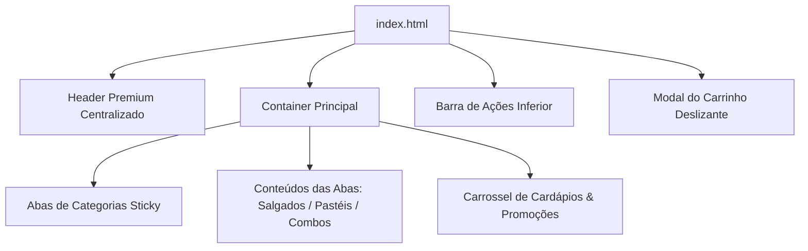

# Documentação Técnica - Cardápio Digital Fritas Express

Esta documentação detalha a arquitetura, estrutura visual, estilo e lógica de interatividade do **Cardápio Digital Fritas Express**, uma aplicação web do tipo Single-Page Application (SPA) responsiva e otimizada para smartphones e computadores.

---

## 1. Visão Geral do Projeto
O **Fritas Express** é um cardápio interativo e sistema de pedidos automatizado que permite aos clientes selecionar produtos, ajustar quantidades, revisar o resumo do carrinho e enviar o pedido diretamente para o WhatsApp do estabelecimento comercial, com mensagens pré-formatadas.

### Stack Tecnológico
* **Estrutura**: HTML5 Semântico.
* **Estilização**: Vanilla CSS3 com variáveis nativas, propriedades de *scroll snapping* e responsividade móvel inteligente (*media queries*).
* **Lógica**: Vanilla JavaScript (ES6+) assíncrono, orientado a eventos e manipulador de DOM (sem dependências externas para garantir máxima velocidade de carregamento).

---

## 2. Arquitetura da Página (Estrutura SPA)

O arquivo principal [index.html](file:///c:/Users/Araujo/Documents/fritas/Projeto-FritasExpress/index.html) é estruturado em uma única página dividida em seções modulares:



---

## 3. Detalhamento dos Módulos Visuais

### A. Header Premium Centralizado
* **Layout**: Alinhamento vertical com `flex-direction: column`, centralizando o logotipo e os textos perfeitamente.
* **Logo Circular**: Borda arredondada completa (`border-radius: 50%`), sombra suave de elevação e contorno contrastante em amarelo (`3px solid var(--amarelo)`).
* **Tipografia**: Título de `32px` com sombra de texto para maior profundidade.

### B. Barra de Abas Flutuante (Sticky Tabs)
* **Comportamento**: A barra de categorias (`.category-tabs`) flutua com a rolagem do usuário e gruda no topo do visor (`position: sticky; top: 10px; z-index: 100`) para acesso rápido.
* **Estética**: Bordas totalmente arredondadas, fundo cinza-claro minimalista e botões no estilo pílula (*pill buttons*). A aba selecionada se transforma em vermelho vibrante com letras brancas e sombra projetada.
* **Transição**: A troca de aba executa um efeito de entrada suave (`@keyframes tabFadeIn`) com transição de opacidade (`0` a `1`) e elevação física (`8px` a `0`).

### C. Catálogo de Produtos e Responsividade
* **Desktop**: Os cards de produtos são exibidos de forma horizontal, otimizando o aproveitamento de espaço em telas amplas.
* **Smartphones (Mobile-First)**: Em resoluções iguais ou menores que `480px`, os cards se transformam automaticamente em blocos verticais:
  - As fotos promocionais dos combos ocupam a largura total superior, funcionando como banners atrativos.
  - Título e descrição são centralizados de maneira uniforme.
  - O seletor de quantidade e valor total fica isolado no rodapé do card, delimitado por uma **linha tracejada decorativa** (`border-top: 1px dashed rgba(0,0,0,0.08)`) para refinamento estético.

### D. Carrossel de Banners e Promoções
* **Navegação Física**: Permite gestos de toque (swipe) nativos no celular e arraste manual com o mouse (drag-to-scroll) no computador.
* **Alinhamento Magnético**: O carrossel usa `scroll-snap-type: x mandatory` garantindo que os cartões promocionais sempre parem perfeitamente centralizados no visor ao finalizar o deslize.
* **Dots Inteligentes**: Pílulas de controle no rodapé que expandem de tamanho (`width: 18px; border-radius: 4px`) e mudam de cor em tempo real para acusar a foto atual sob foco.
* **Setas SVG Responsivas**: Botões laterais flutuantes com setas minimalistas surgem em desktops para navegação clássica, mas são ocultados de forma inteligente em telas touch.

### E. Carrinho de Compras (Slide-Up Modal)
* **Deslize de Fundo**: Uma tela de modal de checkout que sobrepõe o catálogo deslizando suavemente de baixo para cima (`transform: translateY(100% => 0)`).
* **Bloqueio de Fundo**: Ao abrir o carrinho, o scroll da página de produtos ao fundo é suspenso (`overflow: hidden`), impedindo o conflito de rolagens cruzadas.
* **Resumo de Itens**: Uma lista gerada dinamicamente contendo quantidades, nomes de produtos selecionados, valores calculados por item e o somatório geral.
* **Formulário Otimizado**: Reúne os campos obrigatórios ("Nome" e "Endereço") antes da finalização.
* **Ação do WhatsApp**: O botão verde fixado no rodapé do modal possui sombra de destaque brilhante e redireciona os dados para o WhatsApp.

---

## 4. Lógica JavaScript de Interatividade

A programação dinâmica é ativada após o carregamento completo do DOM (`DOMContentLoaded`). Seguem os principais scripts desenvolvidos:

### A. Troca de Abas de Categorias
Monitores de clique nos botões de abas removem a classe `.active` dos elementos desmarcados e injetam a classe `.active` na aba e no contêiner correspondente:
```javascript
tabs.forEach(tab => {
    tab.addEventListener('click', () => {
        const targetId = tab.getAttribute('data-target');
        tabs.forEach(t => t.classList.remove('active'));
        contents.forEach(c => c.classList.remove('active'));
        tab.classList.add('active');
        document.getElementById(targetId).classList.add('active');
    });
});
```

### B. Vinculação Inteligente do Carrossel
Ao clicar em qualquer imagem do carrossel no rodapé, o sistema:
1. Alterna o catálogo para a aba "Combos" clicando nela programaticamente.
2. Descobre o card de combo referente através do atributo `data-target-id`.
3. Executa uma rolagem suave (`scrollIntoView`) para centralizar o produto.
4. Injeta a classe `.highlight-flash` para fazer o card piscar com luz de fundo amarela por 1,5 segundos.
```javascript
img.addEventListener('click', () => {
    const targetId = img.getAttribute('data-target-id');
    if (targetId) {
        document.querySelector('[data-target="tab-combos"]').click();
        const targetCard = document.getElementById(targetId);
        if (targetCard) {
            setTimeout(() => {
                targetCard.scrollIntoView({ behavior: 'smooth', block: 'center' });
                targetCard.classList.add('highlight-flash');
                setTimeout(() => targetCard.classList.remove('highlight-flash'), 1500);
            }, 150);
        }
    }
});
```

### C. Desktop Drag-to-Scroll (Arrastar com o Mouse)
Para mouses convencionais, removemos o arrastar de imagens nativo do navegador e implementamos um cálculo de rolagem com base no movimento físico:
* No clique (`mousedown`), desativamos a rolagem suave (`scrollBehavior: auto`) para que a resposta seja imediata ao mouse.
* Ao movimentar (`mousemove`), calculamos o deslocamento em relação ao clique inicial e movemos o scroll horizontal (`scrollLeft`).
* Ao soltar (`mouseup`), reativamos a rolagem suave (`scrollBehavior: smooth`) e forçamos o snap para a imagem inteira mais próxima.

### D. Integração e Validação com WhatsApp
A função `enviarPedido()` faz a varredura nos cards, captura os itens com quantidade maior que zero, formata a mensagem com formatação rica do WhatsApp (`*Negrito*`, `• Bullet Points`) e envia os parâmetros para a URL oficial da API do WhatsApp:
```javascript
const numeroWhatsApp = '558591432781';
const mensagem = `*Novo Pedido - Fritas Express* 🍟\n\n` +
                 `*Cliente:* ${nome}\n` +
                 `*Endereço:* ${endereco}\n\n` +
                 `*Itens do Pedido:*\n${itensTexto}\n` +
                 `*Total:* R$ ${total.toFixed(2).replace('.', ',')}\n\n` +
                 `_Por favor, envie a chave Pix para pagamento!_`;
const url = `https://api.whatsapp.com/send?phone=${numeroWhatsApp}&text=${encodeURIComponent(mensagem)}`;
window.open(url, '_blank');
```

---

## 5. Design System (Guia de Estilos)

O layout segue regras estritas com variáveis em CSS para consistência visual:

| Token / Variável | Valor | Aplicação Primária |
| :--- | :--- | :--- |
| `--vermelho` | `#cc0000` | Cabeçalho, botões ativos, títulos e preços |
| `--amarelo` | `#ffcc00` | Subtítulo do cabeçalho, botões de quantidade e contornos |
| `--escuro` | `#222222` | Textos primários e fontes |
| `--claro` | `#f9f9f9` | Fundo geral da página e do modal do carrinho |

---

## 6. Sugestões de Melhorias Futuras
* **Carrinho Editável**: Permitir a exclusão ou redução de quantidades de itens diretamente de dentro do resumo do modal do carrinho.
* **Integração de Cupons**: Adicionar um campo de cupom de desconto que recalcula o subtotal antes de enviar a mensagem do WhatsApp.
* **Cálculo de Taxa de Entrega**: Integrar uma lógica simples de taxa de entrega baseado no bairro selecionado pelo cliente.
